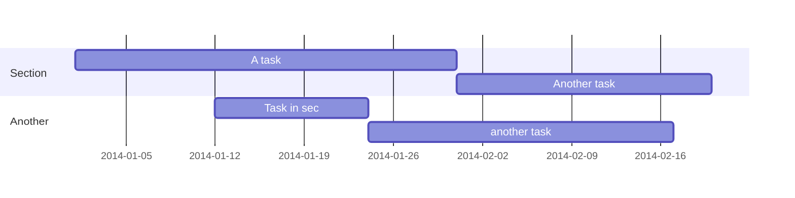

{}

## Callouts

{}
A Markdown callout is useful for displaying notices, hints, or definitions to your readers.
{}


{}
a markdown callout is useful for displaying notices, hints, or definitions to your readers.
{}

## Diagrams




```python
import this

print("Hello world")
```


```mermaid
sequenceDiagram
          autonumber
          par Action 1
            Alice->>John: Hello John, how are you?
          and Action 2
            Alice->>Bob: Hello Bob, how are you?
          end
          Alice->>+John: Hello John, how are you?
          Alice->>+John: John, can you hear me?
          John-->>-Alice: Hi Alice, I can hear you!
          Note right of John: John is perceptive
          John-->>-Alice: I feel great!
              loop Every minute
                John-->Alice: Great!
            end
``````
